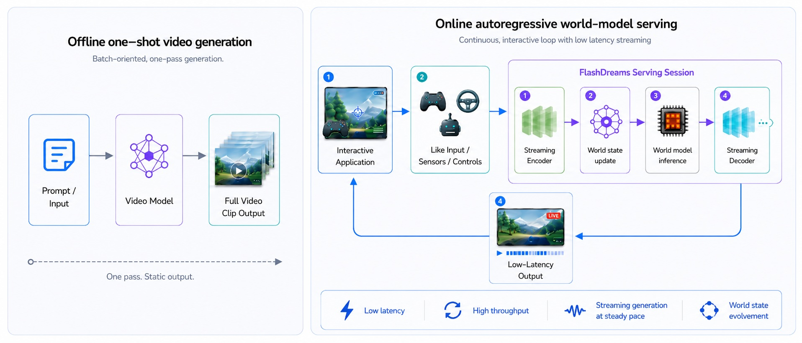

<!--
SPDX-FileCopyrightText: Copyright (c) 2026 NVIDIA CORPORATION & AFFILIATES. All rights reserved.
SPDX-License-Identifier: Apache-2.0
-->

<p align="center">
  
</p>

<p align="center">
  <a href="LICENSE"></a>
  <a href="https://github.com/NVIDIA/flashdreams/issues"></a>
</p>

**FlashDreams** is a high-performance inference and serving library for
interactive autoregressive video and world models. It began as the optimized
runtime behind the [OmniDreams closed-loop demo for GTC 2026][omnidreams-blog]
and has grown into a general platform for real-time world-model applications
across gaming, autonomous vehicles, robotics, simulated or virtual
environments, and more.

[omnidreams-blog]: https://research.nvidia.com/labs/sil/projects/omnidreams-blog/

<p align="center">
  
</p>

## Why FlashDreams

- **Low latency** — keep the interaction responsive when controls, sensors,
  or user input change.
- **High throughput** — keep the GPU busy across autoregressive steps and
  multi-GPU execution.
- **Steady streaming generation** — stream frames or chunks at a steady pace
  while the session stays alive.
- **World-state evolution** — carry rolling state forward so the generated
  world evolves across steps.
- **Production-oriented serving** — a serving backend for persistent,
  low-latency world-model sessions with multi-GPU support and streaming I/O.

The full design rationale lives in the
[documentation overview](docs/source/index.rst).

## Quickstart

The complete setup is in
[`docs/source/quickstart/installation.rst`](docs/source/quickstart/installation.rst).
The shortest viable path is:

```bash
git clone https://github.com/NVIDIA/flashdreams.git
cd flashdreams
uv sync --extra dev --extra runners
export HF_TOKEN=<your-hf-token>
uv run flashdreams-run --help
```

Then launch your first model by following
[`docs/source/quickstart/first_world_model.rst`](docs/source/quickstart/first_world_model.rst).
For example, the offline Self-Forcing T2V quickstart command is:

```bash
uv run --project integrations/self_forcing \
    flashdreams-run self-forcing-wan2.1-t2v-1.3b-flash \
    --total-blocks 7
```

You can also install FlashDreams as a library from PyPI:

```bash
pip install flashdreams
```

## Supported models

FlashDreams ships first-party integrations under
[`integrations/`](integrations/). Each model has a dedicated docs page with
runner slugs, multi-GPU commands, and (where available) profiling benchmarks.

| Model | Family | Docs |
| --- | --- | --- |
| [Self-Forcing](docs/source/models/self_forcing.rst) | Streaming Wan2.1 T2V | Ready |
| [OmniDreams](docs/source/models/omnidreams.rst) | HDMap-conditioned driving world model | Ready |
| [LingBot-World](docs/source/models/lingbot_world.rst) | Camera-controllable I2V world model | Ready |
| [Wan2.1](docs/source/models/wan21.rst) | Bidirectional T2V / I2V reference | Ready |
| [Causal-Forcing](docs/source/models/causal_forcing.rst) | Streaming Wan2.1 T2V / I2V | Docs coming soon |
| [Causal Wan2.2](docs/source/models/causal_wan22.rst) | FastVideo CausalWan 2.2 14B MoE T2V | Docs coming soon |
| [FlashVSR](docs/source/models/flashvsr.rst) | Streaming video super-resolution | Docs coming soon |
| [Cosmos-Predict2.5](docs/source/models/cosmos_predict2.rst) | Bidirectional T2V / I2V | Docs coming soon |

See [`docs/source/models/index.rst`](docs/source/models/index.rst) for the
model gallery and [`docs/source/developer_guides/new_integration.rst`](docs/source/developer_guides/new_integration.rst)
to add your own.

## Developer guides

For internals and extension points, start with:

- [Inference pipeline overview](docs/source/developer_guides/inference_pipeline_overview.rst)
  — generation loop, transformer / encoder / decoder contracts,
  AR caches, CP, CFG, KV cache, CUDA-graph wrapping.
- [Config system](docs/source/developer_guides/config_system.rst)
  — pipeline and runner configuration, overrides, presets.
- [Add a new method](docs/source/developer_guides/new_integration.rst)
  — register a new model integration end to end.

For day-to-day development:

```bash
uv run pre-commit run -a
uv run pytest -m "not manual"
```

See [`DEV.md`](DEV.md) for repository-specific workflow notes and
[`PERFORMANCE.md`](PERFORMANCE.md) for performance methodology.

## Contributing

Bug reports, feature requests, performance work, new integrations, and
documentation fixes are all welcome. The full process — DCO sign-off, PR
expectations, coding conventions, and local-build speedups — is in
[`CONTRIBUTING.md`](CONTRIBUTING.md).

## License

FlashDreams is released under the [Apache License 2.0](LICENSE). Third-party
components and their licenses are listed in
[`THIRD-PARTY-NOTICES`](THIRD-PARTY-NOTICES) and [`NOTICE`](NOTICE). The
repository is REUSE-compliant; see [`REUSE.toml`](REUSE.toml) and
[`LICENSES/`](LICENSES/).

## Citation

If FlashDreams is useful in your research or product, please cite the project:

```bibtex
@misc{flashdreams2026,
  title        = {FlashDreams: High-performance inference and serving for
                  interactive autoregressive video and world models},
  author       = {{NVIDIA Corporation}},
  year         = {2026},
  howpublished = {\url{https://github.com/NVIDIA/flashdreams}},
}
```
