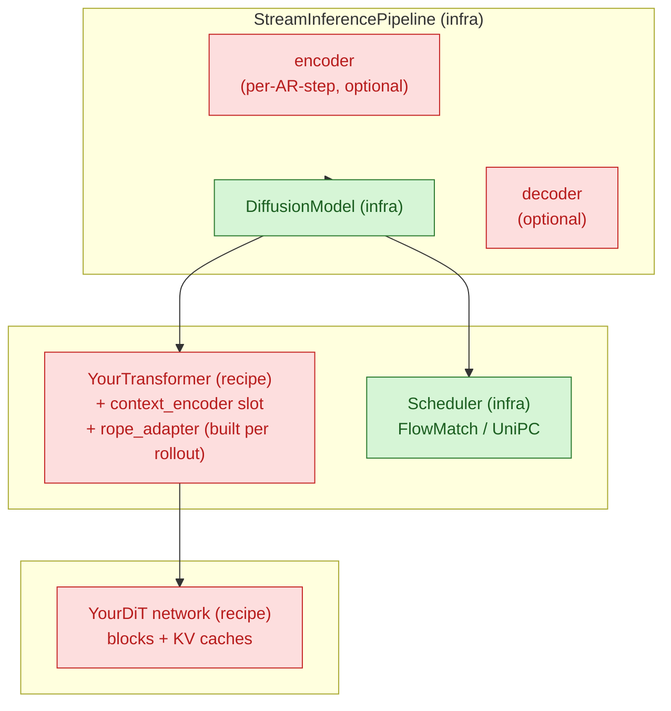

# flashdreams recipe architecture

A map of how `flashdreams/` is organized and how a single rollout flows through the framework. Read once before adding a recipe under `flashdreams/flashdreams/recipes/` or restructuring an existing one. Keep docstrings consistent with the `python-docstring-style` skill.

> **The fastest way to learn this codebase is to clone the structure of `recipes/template/`.** It is the reference recipe — every contract this skill describes is wired up there in its minimal form. Skim it side-by-side with this document.

## TL;DR

- Three layers, strict dependency direction: `core` → `infra` → `recipes`. `infra` and `core` never import from `recipes`. Recipes may import from each other to reuse a sibling recipe's transformer/encoder/decoder.
- A recipe = a `Pipeline` that owns a `DiffusionModel` + optional `Encoder` / `StreamingDecoder`. The `DiffusionModel` owns a `Transformer` + a `Scheduler`. You author the recipe-specific subclasses of these and a `build_*(...)` config builder.
- Per-rollout state lives in nested `*Cache` dataclasses that mirror the same containment tree.
- Lifecycle: `pipeline.initialize_cache(...)` once, then a loop of `pipeline.generate(ar_idx, ...)` + `pipeline.finalize(ar_idx, ...)`.
- Two shape regimes, separated by `transformer.patchify_and_maybe_split_cp`: pre-patchify `[B, C, T, H, W]` outside, post-patchify `[B, L/cp, C]` inside.

## 1. Codebase layout

```
flashdreams/
├── core/        reusable numerical primitives (no recipe-specific code, no infra deps)
├── infra/       framework contracts + orchestration (ABCs, base configs, pipeline glue)
└── recipes/     concrete model bindings that satisfy the infra contracts
```

| Layer    | Owns                                                                                                                                                                                                                                | Imports from |
|----------|--------------------------------------------------------------------------------------------------------------------------------------------------------------------------------------------------------------------------------------|--------------|
| `core/`  | `attention/` (`NativeAttention`, `RingAttention`, `BlockKVCache`, `RotaryPositionEmbedding3D`, `apply_rope_freqs`), `checkpoint/load.py`, `distributed/` (`split_inputs_cp`, `cat_outputs_cp`, `*_object_list`), `io/`             | nothing in flashdreams |
| `infra/` | `config` (`InstantiateConfig`, `derive_config`), `pipeline` (`StreamInferencePipeline*`), `diffusion.{model, scheduler, transformer}` (ABCs + base impls), `encoder` (`Encoder` + `StreamingEncoder` + `StreamingVideoEncoder` + `NullEncoder`), `decoder` (`StreamingDecoder` + `StreamingVideoDecoder`), `compile`, `cuda_graph`, `profiler` | `core`       |
| `recipes/<name>/` | concrete model: `transformer/`, optional `encoder.py` / `decoder.py` / `pipeline.py`, `config.py` builders                                                                                                                  | `core`, `infra` |

### Where does this code go?

| Question                                                | Layer                              |
|---------------------------------------------------------|------------------------------------|
| New attention kernel or shared CUDA utility             | `core/`                            |
| Reusable text/CLIP encoder any recipe could use         | `infra/encoder/<kind>/`            |
| New ABC or generic orchestrator                         | `infra/`                           |
| Model-specific DiT, control encoder, or VAE             | `recipes/<name>/`                  |
| CLI entry point or profiling script                     | `flashdreams/examples/run_*.py`    |

If you're tempted to add a recipe-specific branch in `infra/` or `core/` — expose a config slot or override hook instead.

## 2. What a pipeline contains

The whole framework is built around three nested objects: pipeline, diffusion model, transformer. Each layer (a) holds the next layer down and (b) holds a per-rollout cache that mirrors the same shape.



**Containment, top-down:**

- `StreamInferencePipeline` (use as-is in most cases)
  - `encoder: StreamingEncoder | None` (optional; per-AR-step control like HDMap, camera, first-frame VAE)
  - `diffusion_model: DiffusionModel`
    - `transformer: YourTransformer` ← you write this
      - `network: YourDiT` ← you write this
      - `context_encoder: Encoder` (one-shot encoder slot — text / CLIP-image / `NullEncoder`)
      - `rope_adapter: RotaryPositionEmbedding3D` (built per rollout, lives on the cache)
    - `scheduler: FlowMatchScheduler | UniPCScheduler` (pick from `infra.diffusion.scheduler`)
  - `decoder: StreamingDecoder | None` (optional; latent → pixels). Use `StreamingVideoDecoder` when the decoder is a pixel-video VAE.

**The per-rollout cache mirrors that tree** (`StreamInferencePipelineCache` → `transformer_cache` → `network_cache`). Each level forwards `before_update` / `after_update` to the level below.

### One-shot context vs per-AR-step control input

There are **two encoder slots**, and they take different base classes. Confusing them is the most common pitfall.

| Slot                                          | Runs                                | Base class                  | Input                              | Disable             |
|-----------------------------------------------|-------------------------------------|-----------------------------|------------------------------------|---------------------|
| `transformer.context_encoder` (one-shot)      | once, in `initialize_autoregressive_cache` | `Encoder` (stateless)       | text prompts, reference image      | `NullEncoderConfig()` |
| `pipeline.encoder` (per-AR-step)              | every AR step, in `pipeline.generate` | `StreamingEncoder` (stateful, has cache) | per-step control (HDMap, camera, hand-crafted control latent) | `encoder=None`      |

Text encoders (subclass `Encoder`) go on `context_encoder`. Per-AR-step controls (subclass `StreamingEncoder`) go on `pipeline.encoder`. Putting a text encoder on the per-AR-step slot reruns it every step; putting a streaming encoder on the one-shot slot drops its cache.

The decoder slot (`pipeline.decoder`) takes a `StreamingDecoder` (stateful, `forward(input, ar_idx, cache)`). Use `StreamingVideoDecoder` for pixel-video VAEs (WAN VAE, TAEHV) — it adds the spatial / temporal compression contracts the pipeline needs to size pixel I/O. Stateless decoders just return an empty `StreamingDecoderCache` from `initialize_autoregressive_cache` and ignore `autoregressive_index` / `cache` in `forward` (see `template/decoder.py`).

**Where the per-AR-step control tensor flows.** This is the path a new control input (HDMap, camera trajectory, ...) takes through the framework. Defining a new control = author one `StreamingEncoder` subclass under `recipes/<name>/encoder.py` and consume the `control` arg inside your network's forward.

```
user passes raw control as `pipeline.generate(ar_idx, cache, input=hdmap)`
          │     [B, C_ctrl, T, H, W]
          ▼
pipeline.encoder.forward(input, ar_idx, cache.encoder_cache)        ← recipes/<name>/encoder.py
          │     [B, C_latent, T, H, W]   (still pre-patchify; same T/H/W as the noisy latent)
          ▼
diffusion_model.generate(ar_idx, transformer_cache, input=encoded)
          │
          ├── transformer.patchify_and_maybe_split_cp(encoded)
          │     [B, L/cp, C]
          │
          └── scheduler loop:
                transformer.predict_flow(noisy, t, cache, input=patchified_control)
                  └── network.forward(noisy, ..., control=patchified_control)
                        └── x = input_proj(noisy) + input_proj(control)   # additive bias
```

Two corollaries:

- **The encoder's output shape must match the noisy latent's pre-patchify shape** so the same `patchify_and_maybe_split_cp` call works on both, and so the network can fuse them as an additive bias on the per-token channel dim.
- **`encoder=None` round-trips `input=None` end-to-end.** Your network's `forward` should treat `control=None` as "skip the control bias" — `recipes/template/transformer/network.py` is the reference. This lets the same recipe support both controlled and uncontrolled rollouts without a separate config.

## 3. Anatomy of a recipe

A minimum viable recipe (what `recipes/template/` ships) is **3 files and 4 classes**:

```
recipes/<name>/
├── transformer/
│   ├── __init__.py          YourTransformerConfig + YourTransformerCache + YourTransformer
│   └── network.py           YourDiTConfig + YourDiTCache + YourDiT
└── config.py                build_<variant>(...) → StreamInferencePipelineConfig
                             <NAME>_CONFIG_BUILDERS dict
```

Add files only when you actually need them:

| File                | When to add                                                         |
|---------------------|---------------------------------------------------------------------|
| `encoder.py`        | recipe needs a per-AR-step control input                            |
| `decoder.py`        | recipe owns the latent → pixel stage                                |
| `pipeline.py`       | rare — only when `pipeline.initialize_cache(...)` needs a custom signature (e.g. derive per-rollout `(height, width)` from an input image, accept text strings instead of pre-encoded embeddings) |
| `transformer/impl/` | network is large enough to split (`modules.py`, `network.py`, ...)  |
| `config/`           | many shipped variants — split `config.py` into a package            |
| `transformer/constants.py` | transformer-scoped constants (e.g. CFG negative prompt). Recipe-wide URIs go in `<recipe>/constants.py`; subpackage-specific constants live with the consumer. |

### What you have to implement

The contracts are all under `flashdreams.infra`. Subclass and override.

- **`Transformer[YourCache]`** (`infra.diffusion.transformer`)
  - `__init__(config)` — **single argument**. Don't take a `device` kwarg; the caller does `model.to(device)` (or `pipeline.setup().to(device)`). Keep `__init__` cheap: build sub-modules, derive `_cuda_graph_capture_ar_idx`, leave `_output_height = _output_width = None` until cache build time.
  - `latent_shape` (property) — **per-rank** post-patchify shape (already CP-divided). Asserts `_output_height` / `_output_width` are set; reading before `initialize_autoregressive_cache` must fail loudly.
  - `patchify_and_maybe_split_cp(x)` / `unpatchify_and_maybe_gather_cp(x)` — the only place the pre/post-patchify boundary crosses.
  - `predict_flow(noisy_latent, timestep, cache, input=None)` — one flow-match forward, with CFG merge when `cache.network_cache_uncond` is populated.
  - `initialize_autoregressive_cache(*, height, width, **transformer_context)` — receives the per-rollout spatial layout, stashes it as `self._output_height` / `self._output_width`, runs context encoders, allocates KV buffers, builds the `RotaryPositionEmbedding3D` adapter, lazy-builds `CUDAGraphWrapper`s, and returns `YourCache`. Do all divisibility checks here (`H % patch_spatial == 0`, `L % cp_size == 0`, ...).
  - Optional: `postprocess_clean_latent` (e.g. I2V first-frame pin), `finalize_kv_cache` (default runs one extra `predict_flow` to advance the cache).

- **`YourTransformerCache(TransformerAutoregressiveCache)`** — an `@dataclass(kw_only=True)` carrying `network_cache`, `network_cache_uncond | None`, `rope_adapter`, `rope_freqs | None`, `autoregressive_index`. Its `start(ar_idx)` and `finalize(ar_idx)` hoist KV `before_update` / `after_update` and the RoPE shift out of the (potentially graph-captured) network forward. See `recipes/template/transformer/__init__.py`.

- **`YourTransformerConfig(InstantiateConfig[YourTransformer])`** — exposes the standard knobs (see §5).

- **`Encoder` / `StreamingEncoder` / `StreamingDecoder`** (only if you ship them — pick the right base class for the slot):
  - **`Encoder`** (stateless, slim `forward(self, input)`) — `transformer.context_encoder` only. Text encoders (UMT5, Cosmos-Reason1), CLIP image encoders, identity (`NullEncoder`).
  - **`StreamingEncoder[YourCache]`** (`forward(self, input, autoregressive_index, cache)` + `initialize_autoregressive_cache(**encoder_context)`) — `pipeline.encoder` only. Per-AR-step controls (HDMap, camera, I2V first-frame VAE).
  - **`StreamingVideoEncoder[YourCache]`** (subclass of `StreamingEncoder`) — pixel-video encoders. Adds the `spatial_compression_ratio` / `temporal_compression_ratio` properties plus the AR-step-aware `get_output_temporal_size(ar_idx, input_T)` / `get_input_temporal_size(ar_idx, output_T)` mappers. Subclass this whenever the pipeline needs to size pixel I/O without knowing the encoder's causal-padding topology — e.g. WAN VAE encoder, PixelShuffle pseudo-VAE, the I2V wrappers around them.
  - **`StreamingDecoder[YourCache]`** (`forward(self, input, autoregressive_index, cache)` + `initialize_autoregressive_cache(**decoder_context)`) — `pipeline.decoder`. Stateful decoders (e.g. WAN VAE) thread a per-rollout cache across AR steps; stateless decoders (e.g. `template/decoder.py`'s 1×1 Conv3d) just return an empty `StreamingDecoderCache` and ignore the cache argument.
  - **`StreamingVideoDecoder[YourCache]`** (subclass of `StreamingDecoder`) — pixel-video decoders. Adds the `spatial_compression_ratio` / `temporal_compression_ratio` properties plus the AR-step-aware `get_output_temporal_size(ar_idx, input_T)` / `get_input_temporal_size(ar_idx, output_T)` mappers. Subclass this (instead of plain `StreamingDecoder`) whenever the pipeline needs to size pixel I/O without knowing the decoder's causal-padding / sliding-window topology — e.g. WAN VAE, TAEHV.

- **Pipeline subclass** — almost never. Use `StreamInferencePipelineConfig` directly and plug encoders into the slots above.

## 4. The rollout lifecycle

A "rollout" = build a cache once, then loop AR steps. Bidirectional models are N=1; streaming AR is N≥2.

```
pipeline.initialize_cache(*, image=None, height=None, width=None, ...)
  ├── derive (height, width) from image.shape[-2:] OR from explicit kwargs
  ├── pack into transformer_context = {"height": H, "width": W, ...}
  └── transformer.initialize_autoregressive_cache(**transformer_context)
        ├── self._output_height, self._output_width = height, width
        ├── assert H % patch_spatial == 0, (T*H*W) % cp_size == 0, ...
        ├── context_encoder(context) → context_embeddings
        ├── if guidance_scale > 1.0: context_encoder(negative_context)
        ├── allocate KV slots (cond + optional uncond)
        ├── build RotaryPositionEmbedding3D for this (height, width, head_dim)
        └── if use_cuda_graph: build two CUDAGraphWrapper(network)

for ar_idx in range(N):
    pipeline.generate(ar_idx, cache, input)
      ├── encoder.forward(input, ar_idx, ...)        # optional, per-AR-step control
      ├── diffusion_model.generate(ar_idx, ...)
      │     ├── transformer.patchify_and_maybe_split_cp(input)
      │     ├── cache.start(ar_idx)                  # rope_freqs = shift_t; KV before_update
      │     ├── noisy = randn(transformer.latent_shape)
      │     ├── for _ in range(num_inference_steps):
      │     │     scheduler.step(noisy, t, predict_flow)
      │     │       └── transformer.predict_flow(...)         # CFG merge inside
      │     ├── transformer.postprocess_clean_latent(...)     # e.g. I2V pin
      │     └── transformer.unpatchify_and_maybe_gather_cp(clean)
      └── decoder.forward(clean, ar_idx, ...)        # optional, latent → pixels

    pipeline.finalize(ar_idx, cache)
      └── diffusion_model.finalize(...)
            ├── if context_noise > 0: scheduler.add_noise(clean, context_noise)
            ├── transformer.finalize_kv_cache(noisy, ...)     # one extra predict to advance KV
            └── cache.finalize(ar_idx)                        # KV after_update
```

### The shape boundary

There are exactly two shape regimes, separated by patchify:

- **Pre-patchify** (user, pipeline, encoder, decoder): `[B, C, T, H, W]` for video, `[B, N_ctx, D]` for context.
- **Post-patchify** (network, scheduler, KV cache): `[B, L/cp, C]` with `L = T*H*W`.

`patchify_and_maybe_split_cp` is the only place that boundary crosses. Never CP-split or gather at a call site.

## 5. Cross-cutting conventions

Compressed reference. The first time you touch one of these, also read the matching code in `recipes/template/`.

### Configs and builders

- Every config: `@dataclass(kw_only=True)` extending `InstantiateConfig[Target]`, with `_target = field(default_factory=lambda: Target)`. **Never** use a bare instance as a default — always `field(default_factory=...)`.
- **Avoid `__post_init__`.** It's a smell:
  - *Derived sub-config fields* (e.g. `network.in_dim = base + control_channels`) belong in the **builder** — set the final value when you construct the sub-config. Fold conditional channel math into the builder so `network.in_dim` is the actual integer the network sees.
  - *Cross-field constants* derived purely from config (e.g. `_cuda_graph_capture_ar_idx`) belong on the **transformer instance**, computed in `__init__`. The config should be pure data.
  - *Per-rollout shape checks* (divisibility, etc.) belong in `initialize_autoregressive_cache`, not on the config — `(height, width)` aren't config fields.
  - If you can't move it, the validation probably belongs at instantiation time anyway. Keeping configs `__post_init__`-free makes them trivially serializable and `derive_config`-friendly.
- One `build_<variant>(...) -> StreamInferencePipelineConfig` per shipped variant in `config.py`. Keyword-only, sensible defaults.
- Register them in `<NAME>_CONFIG_BUILDERS: dict[str, Callable[..., StreamInferencePipelineConfig]]`.
- Derive variants with `derive_config(base, **changes)` instead of duplicating builder bodies. Publish reusable derive-patches as helpers (template ships `with_compile_and_cuda_graph(base)`).
- Export builder-side spatial defaults (`DEFAULT_VIDEO_HEIGHT`, `DEFAULT_VIDEO_WIDTH`, `<NAME>_VAE_SPATIAL_COMPRESSION`) as **module-level constants without leading underscore** in `config.py`. Examples and integrations import these to compute latent dimensions; keeping them private forces every caller to hard-code the same numbers.

### Standard transformer config knobs

Keep these names stable across recipes — tests and tooling look for them:

`network`, `context_encoder` (defaults to `NullEncoderConfig()`), `dtype`, `checkpoint_path` (`None` → random init), `len_t`, `window_size_t`, `sink_size_t`, `guidance_scale`, `compile_network`, `use_cuda_graph`, `cuda_graph_warmup_iters`, `h_extrapolation_ratio`, `w_extrapolation_ratio`. Plus a `requires_negative_context_embeddings` property → `guidance_scale > 1.0`.

**Not config fields:** `height`, `width`, `cp_size`, `device`. These are per-rollout (`height`/`width` → `initialize_autoregressive_cache`), launch-time (`cp_size` → auto-detect from `torch.distributed`), or call-site (`device` → `model.to(device)`).

### Per-rollout spatial layout (`height`, `width`)

`(height, width)` are **pre-patchify pixel-latent dimensions** for the rollout. They belong on `initialize_autoregressive_cache`, not the config:

- The pipeline derives them and forwards them inside `transformer_context`. For I2V the pipeline reads them off `image.shape[-2:]`; for T2V the pipeline accepts explicit `height`/`width` kwargs (see `recipes/wan/pipeline.py` for the I2V-or-explicit-fallback pattern).
- The transformer stashes them as `self._output_height` / `self._output_width` — **raw pre-patchify dims, not divided by `patch_spatial`**. Compute `pH = _output_height // network.patch_spatial` inline at the use site (`latent_shape`, `unpatchify_and_maybe_gather_cp`, `_build_network_cache`). Storing the pre-patchify value keeps the variable's meaning unambiguous and matches what the user passed in.
- Builders (`config.py`, `conditioning_wrapper.py`) **never set `network.height`/`width`** on the transformer config — they're not there. They configure the *static* fields of `network` (`additional_concat_ch`, `enable_cross_view_attn`, `in_dim`, ...) and let `initialize_autoregressive_cache` thread the per-rollout shape.
- Guards that depend on the rollout shape (`(L = T*H*W) % cp_size == 0`, `H % patch_spatial == 0`) live in `initialize_autoregressive_cache`, not `__post_init__`.

### Context parallelism (CP)

- **Auto-detect `cp_size`** at transformer construction from `torch.distributed.get_world_size()`; fall back to `1` when not initialized. The launcher (`torchrun --nproc_per_node=N`) is the single source of truth — don't hard-code `cp_size` on the recipe config.
- Use `flashdreams.core.distributed.{split_inputs_cp, cat_outputs_cp}`; `cp_group=None` is the single-GPU no-op. Use the `_object_list` variants for per-view strings.
- Prefer `flashdreams.core.attention.RingAttention` over manual all-gather + SDPA — it fuses the cross-rank KV gather with the SDPA call via an LSE merge.
- Assert divisibility (`L % cp_size == 0` etc.) at cache build time (inside `initialize_autoregressive_cache`) with a readable message — `(height, width)` aren't known at config-construction time.

### Classifier-free guidance (CFG)

- Off when `guidance_scale == 1.0` and `cache.network_cache_uncond is None`. Short-circuit `predict_flow` to the cond branch in that case; otherwise return `flow_uncond + s * (flow_cond - flow_uncond)`.
- `requires_negative_context_embeddings` drives the assertion: CFG on requires `negative_context` at cache build time. Only encode it inside that `if` branch — CFG-off rollouts shouldn't pay for it.
- When using `CUDAGraphWrapper`, allocate **two independent wrappers** (cond + uncond). The residual streams diverge at the first context-bias addition and must not share static buffers.

### KV cache + `torch.compile` + CUDA graphs

The interaction here is subtle — only opt in once eager works.

- `BlockKVCache` has two code paths: *filling* (append + slice) and *steady-state* (roll-left + overwrite). Each is a separate Dynamo subgraph and autotunes separately the first time it runs.
- Compile with `compile_module(network)` (pins `mode="max-autotune-no-cudagraphs"` so `torch.compile` doesn't manage its own CUDA graphs).
- Wrap the compiled module in `CUDAGraphWrapper(network, warmup_iters=cfg.cuda_graph_warmup_iters)`. `warmup_iters >= 2` drains Inductor autotune on the eager path before capture.
- **Build the wrapper inside `initialize_autoregressive_cache`**, not `__init__`. The graph captures against the current KV-cache pointers; a fresh rollout (new H/W, new cache) needs a fresh wrapper. CFG → two wrappers.
- Dispatch per AR step via a precomputed threshold stored **on the transformer instance**, set once in `__init__` (it depends only on config):
  - `self._cuda_graph_capture_ar_idx = (cfg.sink_size_t + cfg.window_size_t) // cfg.len_t`
  - `ar_idx <` threshold → `wrapper.drain` (eager — drains autotune AND exercises the cache's filling path).
  - `ar_idx >=` threshold → `wrapper.__call__` (warmup → capture → replay).
- Keep the threshold off the *config*. Config is data; this is a derived runtime quantity. Computing it in `__init__` (not `__post_init__`) keeps the config trivially serializable and lets `derive_config` round-trip cleanly.
- If you see `cudaErrorStreamCaptureUnsupported`, autotune is firing inside capture — re-check the threshold and that `.drain` is used throughout filling.
- The template defaults `compile_network=False` and `use_cuda_graph=False` for ease of debugging. Production recipes (Wan, Lingbot, Alpadreams) flip `compile_network=True` as the default in `Wan21TransformerConfig`-style configs and rely on `with_compile_and_cuda_graph(base)` to additionally enable CUDA graphs. Mirror whichever default matches the recipe's intended deployment.

### 3D RoPE

`flashdreams.core.attention.RotaryPositionEmbedding3D` is the shared 3D RoPE for every (T, H, W)-patchified DiT. Use it instead of hand-rolling.

- **Build per rollout, not in `__init__`.** `head_dim` and the per-rollout `len_h`/`len_w` are only known once `(height, width)` are passed to `initialize_autoregressive_cache`. Right after building, call `rope_adapter.set_context_parallel_group(self._cp_group)` so frequency buffers get split along the seq dim.
- **Stash the adapter on the per-rollout cache.** `cache.start(ar_idx)` computes `cache.rope_freqs = rope_adapter.shift_t(ar_idx)` once per AR step, hoisting it out of the network forward. Reuse the same `rope_freqs` for cond and uncond branches.
- **Apply RoPE before `kv_cache.update(k, v)`** — cached K's must already carry positional info, otherwise steady-state attention reads unrotated K's against rotated Q's.
- `interleaved=True` for Wan-style models; default `False` matches the half-split layout.
- NTK extrapolation: `h_extrapolation_ratio` / `w_extrapolation_ratio` (and optionally `t_extrapolation_ratio`) raise the base θ for higher resolution / longer context.

### Scheduler

Pick from `infra.diffusion.scheduler`: `FlowMatchSchedulerConfig` (self-forcing, 1–4 step) or a UniPC variant (full 35–50 step bidirectional). The scheduler config is a field on `DiffusionModelConfig`, not on the recipe or pipeline config.

### Checkpoint loading

```python
if config.checkpoint_path is not None:
    state_dict = load_checkpoint(config.checkpoint_path)
    self.network.load_state_dict(state_dict)
```

`checkpoint_path=None` keeps the random init — the right default for unit tests. Pass a `state_dict_transform` on your transformer config when upstream training adds a prefix (`net.`, `generator_ema.model.`, etc.).

## 6. Testing

- Tests live in `flashdreams/tests/test_<recipe>.py` — top-level `tests/`, not inside the recipe.
- Plain `pytest` + `@pytest.mark.parametrize`. Default to `checkpoint_path=None`, `compile_network=False`, `use_cuda_graph=False`.
- **Always set `compile_network=False` explicitly in unit tests**, even if you think it's the default. Production recipes flip the default to `True`; if a test introspects `transformer.network` (e.g. `isinstance(transformer.network, _DummyNetwork)`) it will silently break when the production default sneaks in via `OptimizedModule`-wrapping.
- When testing per-rollout shape behaviour (divisibility errors, `latent_shape`-not-set asserts), the trigger is `initialize_autoregressive_cache(height=..., width=...)`, not config construction. Update fakes accordingly: `SimpleNamespace` mocks shouldn't carry `_pH`/`_pW`/`_pT`; set `network.patch_temporal` / `patch_spatial` and pass `height` / `width` through the cache-init call.
- Smoke shape: `.setup().to("cuda").eval()`, run ≥ 2 AR steps (covers filling + the first steady step when `window_size_t == 2 * len_t`), assert output shape / device / finiteness.
- CFG on/off, compile + CUDA-graph: `derive_config` patches on the base builder, not separate builders. Compare against the eager baseline in an equivalence test.
- CP equivalence is a **two-invocation** test: a plain pytest run writes a reference to `<tmpdir>/<recipe>/cp_reference.pt`; a `torchrun --nproc_per_node=N` run reads it back and asserts equality. Run both in the same `srun` so they share `/tmp`.

## 7. Scaffolding checklist

Adding a new recipe `foo`:

1. `recipes/foo/transformer/network.py` — `FooDiT` + `FooDiTCache` + `FooDiTConfig`. Use `RingAttention` for CP-aware self-attention. Apply RoPE to q/k *before* `kv_cache.update`. Network config carries `in_dim`, `additional_concat_ch`, `patch_temporal`, `patch_spatial` — never `height`/`width`.
2. `recipes/foo/transformer/__init__.py` — `FooTransformerConfig` (standard knobs above, **no `height`/`width`/`device`/`__post_init__`**), `FooTransformerCache` (carries `rope_adapter` + `rope_freqs`; `start()` hoists `shift_t` and KV `before_update`), `FooTransformer` (single-arg `__init__(config)`; auto-detects CP size; sets `_cuda_graph_capture_ar_idx` and `_output_height = _output_width = None` in `__init__`; `initialize_autoregressive_cache(*, height, width, ...)` stashes the spatial layout and builds the rope adapter and any wrappers).
3. (Optional) `recipes/foo/encoder.py`, `recipes/foo/decoder.py`. Pick the right base class for the slot:
   - Encoder for `transformer.context_encoder` → `Encoder` (slim `forward(self, input)`, no cache).
   - Encoder for `pipeline.encoder` (per-AR-step control) → `StreamingEncoder[YourCache]` (full `forward(self, input, ar_idx, cache)` + `initialize_autoregressive_cache`), or `StreamingVideoEncoder[YourCache]` if it's a pixel-video encoder (adds `spatial_compression_ratio` / `temporal_compression_ratio` + `get_{input,output}_temporal_size`).
   - Decoder for `pipeline.decoder` → `StreamingDecoder[YourCache]` (stateless decoders just return `StreamingDecoderCache()`), or `StreamingVideoDecoder[YourCache]` for pixel-video decoders that need to publish `spatial_compression_ratio` / `temporal_compression_ratio` + `get_{input,output}_temporal_size`.
4. (Rare) `recipes/foo/pipeline.py` only if the base pipeline's `initialize_cache` signature doesn't fit — most commonly to derive `(height, width)` from an input image (I2V) or accept them as explicit kwargs (T2V).
5. `recipes/foo/config.py` — at least one `build_foo_<variant>(...)`; a second variant via `derive_config`; `FOO_CONFIG_BUILDERS` dict; `with_compile_and_cuda_graph(base)` helper if you want the fast path. Export `DEFAULT_VIDEO_HEIGHT`, `DEFAULT_VIDEO_WIDTH`, `<NAME>_VAE_SPATIAL_COMPRESSION` as public module-level constants. Builders fully resolve `network.in_dim` / `network.additional_concat_ch` / etc. so the config has no `__post_init__`.
6. `flashdreams/tests/test_foo.py` — bidirectional smoke + streaming smoke + CFG on/off + no-control branch + compile/CUDA-graph equivalence + CP equivalence. **Always set `compile_network=False` explicitly** in tests that introspect `transformer.network`.

## 8. Common pitfalls

Layer / structure:

- **Recipe-specific imports in `infra/` or `core/`.** Breaks the dependency direction. Add a config slot or override hook instead.
- **Bare instance as a `@dataclass` default.** Mutations leak between rollouts. Use `field(default_factory=...)`.
- **Hard-coded `cp_size` on the recipe config.** Auto-detect from `torch.distributed.get_world_size()`.
- **Plugging a text encoder into `pipeline.encoder`.** That slot runs every AR step and expects a `StreamingEncoder`. Stateless one-shot encoders (text / CLIP / `NullEncoder`) subclass `Encoder` and go on `transformer.context_encoder`.
- **Subclassing `Encoder` for a per-AR-step control input.** The pipeline calls per-AR-step encoders with `(input, ar_idx, cache)` — `Encoder` is the slim stateless base. Use `StreamingEncoder[YourCache]` instead.
- **Forgetting `StreamingVideoDecoder` / `StreamingVideoEncoder` for pixel-video VAEs.** A plain `StreamingDecoder` works, but the pipeline can no longer query `get_{input,output}_temporal_size` to size pixel I/O — you'll end up duplicating that arithmetic in every recipe pipeline.
- **`device` kwarg on `Transformer.__init__`.** Use `model.to(device)` (or `pipeline.setup().to(device)`) at the call site instead. Keeping `__init__` device-free lets configs round-trip without carrying a `torch.device`.

Configs:

- **Putting derived sub-config fields in `__post_init__`.** Set `network.in_dim = base + control_channels` in the **builder**, where the conditional logic is colocated with the option that triggers it. The config should hold the final integer the network sees.
- **Storing per-rollout shape on the config (`config.height`, `config.width`).** They aren't config — they vary every rollout. Pass them through `initialize_autoregressive_cache(height=..., width=...)` and stash them on the transformer instance.
- **`__post_init__` cross-config validation that depends on `(height, width)`.** Move it into `initialize_autoregressive_cache`; that's where the spatial layout actually exists.
- **Underscore-prefixing module-level builder defaults (`_DEFAULT_VIDEO_HEIGHT`, `_WAN_VAE_SPATIAL_COMPRESSION`).** These are imported from `examples/run_*.py` and integrations to compute pixel ↔ latent dimensions; export them publicly.

Latent shape:

- **`latent_shape` returns the global (pre-CP) shape.** It must be per-rank — `DiffusionModel.generate` draws noise at this shape on each rank.
- **Reading `latent_shape` before `initialize_autoregressive_cache`.** Per-rollout `(B, H, W)` is populated lazily; reading earlier must assert.
- **Storing `_pH` / `_pW` / `_pT` (post-patchify) on the transformer.** Store the raw `_output_height` / `_output_width` (pre-patchify) and divide by `network.patch_spatial` / `patch_temporal` inline at the use site. The variable name then matches the dimension the user passed in.
- **Asserting shape with no shape hint in the message.** Add `ndim` and `.shape` to the assertion in `patchify_and_maybe_split_cp`.

CFG / CUDA graphs:

- **Sharing one `CUDAGraphWrapper` across cond and uncond.** Capture fails or silently reuses stale activations. Allocate two.
- **Building the `CUDAGraphWrapper` in `__init__`.** The graph binds to the first cache's KV pointers; the second rollout reads stale storage. Build it inside `initialize_autoregressive_cache`.
- **`_cuda_graph_capture_ar_idx` on the config.** It's a derived runtime quantity, not config data. Compute it once in `Transformer.__init__` and store on the instance.
- **`_cuda_graph_capture_ar_idx = chunks_total // len_t - 1`.** Off-by-one — that's the last filling step, not the first steady step.
- **`compile_network=True` with `mode="max-autotune"`.** `torch.compile` then owns its own CUDA graphs and conflicts with `CUDAGraphWrapper`. Always go through `compile_module`.
- **Unconditional `negative_context` encoding.** Only encode inside `if cfg.requires_negative_context_embeddings:` so CFG-off rollouts don't pay for it.

Tests:

- **Asserting `isinstance(transformer.network, MyDummy)` without setting `compile_network=False`.** Production recipe configs default `compile_network=True`; the assertion will fail against an `OptimizedModule` wrapper. Always pin the flag explicitly in tests that introspect the network.
- **Triggering shape-divisibility errors via the config constructor.** With per-rollout `(height, width)`, those checks moved to `initialize_autoregressive_cache`. Wrap the *cache build* call in `pytest.raises`, not the config call.

RoPE:

- **Building `RotaryPositionEmbedding3D` in `__init__`.** Per-rollout `(height, width)` aren't known yet, and the buffers wouldn't get CP-split for that rollout.
- **Calling `shift_t(ar_idx)` inside `network.forward`.** Re-runs cat / repeat for every cond/uncond pass and ties the index into the captured graph as a Python int. Hoist into `cache.start`.
- **Applying RoPE *after* `kv_cache.update(k, v)`.** Cached K's lose positional info; steady-state attention reads unrotated K's against rotated Q's.
