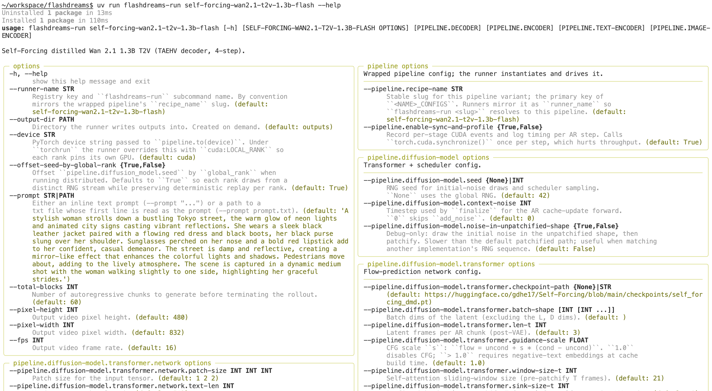

<!-- SPDX-FileCopyrightText: Copyright (c) 2026 NVIDIA CORPORATION & AFFILIATES. All rights reserved. -->

<!-- SPDX-License-Identifier: Apache-2.0 -->

FlashDreams configuration is built around simple, strongly-typed Python `dataclass` objects.
This configuration system is similar to the one employed in [nerfstudio](https://github.com/nerfstudio-project/nerfstudio).
It allows you to easily plug in different permutations of model components and nest configurations to define the complete
inference pipeline.

This page covers model-integration configs. See the [API overview](../api/index.md) for public runtime configs.

## Base components

Configurable inference components (such as the encoder, transformer, scheduler,
and decoder) have corresponding configuration dataclasses. Their interfaces live
under `flashdreams.infra`; concrete reusable implementations live under
`flashdreams.recipes` or in an integration package.
As outlined in the [/developer_guides/inference_pipeline_overview](inference_pipeline_overview.md), the main entry point for defining an integration
is the `~flashdreams.infra.pipeline.StreamInferencePipelineConfig`.

These config objects are modular and nestable.
A typical pipeline config defines the architecture by composing other config dataclasses:

```python

from flashdreams.infra.diffusion.model import DiffusionModelConfig
from flashdreams.infra.diffusion.scheduler.fm import FlowMatchSchedulerConfig
from flashdreams.infra.pipeline import StreamInferencePipelineConfig

# Define your own configs for the encoder, transformer, and decoder
MyStreamingEncoderConfig = ...
MyTransformerConfig = ...
MyStreamingDecoderConfig = ...

# Compose them into a pipeline config
pipeline_config = StreamInferencePipelineConfig(
    name="customized-method-name",
    encoder=MyStreamingEncoderConfig(),
    diffusion_model=DiffusionModelConfig(
        transformer=MyTransformerConfig(),
        scheduler=FlowMatchSchedulerConfig(),
    ),
    decoder=MyStreamingDecoderConfig(),
)

```

## Creating new configs

If you are interested in creating a brand new model component, you will need to create a corresponding config with the associated parameters you want to expose.

Let's say you want to create a new one-shot context encoder called `MyEncoder`.
You can create an `Encoder` subclass and a corresponding `MyEncoderConfig`
whose `_target` field points to that class. Pipeline `encoder` slots instead
require a `~flashdreams.infra.encoder.StreamingEncoder` and its
per-rollout cache contract.

```python

from dataclasses import dataclass, field
from flashdreams.infra.encoder.base import EncoderConfig, Encoder

@dataclass(kw_only=True)
class MyEncoderConfig(EncoderConfig):
    """My custom encoder config."""

    # Point to the class that will be instantiated by this config
    _target: type["MyEncoder"] = field(default_factory=lambda: MyEncoder)

    # Expose your configurable parameters
    embedding_dim: int = 512
    num_layers: int = 6

class MyEncoder(Encoder):
    """My custom encoder model.

    Args:
        config: Configuration to instantiate the encoder.
    """

    # Enable type checking
    config: MyEncoderConfig

    def __init__(self, config: MyEncoderConfig) -> None:
        super().__init__(config)

        # Build your layers using self.config.embedding_dim, etc.
        ...

    def forward(self, input):
        ...

```

Alternatively, you do not always have to write a complete configuration from scratch. You can use `flashdreams.infra.config.derive_config` to create concise variants from existing configs. This allows you to inherit the base settings and only override the specific fields you want to change:

```python

from flashdreams.infra.config import derive_config
from my_project.configs import MY_BASE_PIPELINE_CONFIG

# Deep-copy an existing config instance and override one nested field.
my_variant_config = derive_config(
    MY_BASE_PIPELINE_CONFIG,
    encoder=dict(embedding_dim=1024),
)

```

`derive_config` does not accept a config class. It deep-copies the supplied
instance, applies nested dictionary patches, and raises `KeyError` for an
unknown field.

## Modifying from CLI

Often you just want to play with the parameters of an existing model without specifying a new configuration. The command-line interface, powered by [tyro](https://github.com/brentyi/tyro), exposes every nested dataclass field as a flag.

Because configurations are strongly typed dataclasses, `tyro` generates the CLI automatically. Each shipped model is a named runner slug; pass any nested field as a flag to override it.

For example, the built-in synthetic template runner exposes a complete reference
configuration whose options can be inspected without loading a model:

```bash

uv run flashdreams-run template-autoregressive --help

```



To resolve a modified configuration without instantiating the model:

```bash

uv run flashdreams-run --no-instantiate template-autoregressive \
    --pipeline.diffusion-model.transformer.use-cuda-graph \
    --num-ar-steps 7

```

`flashdreams-run` fronts inference runners and demo API applications. The
separate `flashdreams-run-v2` command runs applications implementing
`flashdreams.api_v2`; its runtime flags precede `--` and application flags
follow it. Those v2 application/session protocols are separate from
`flashdreams.runtime` and its demo layer.

For full details on the available commands, see the [/api/cli](../api/cli.md) reference.
For end-to-end examples of defining custom pipeline configurations, see [/developer_guides/new_integration](new_integration.md).
